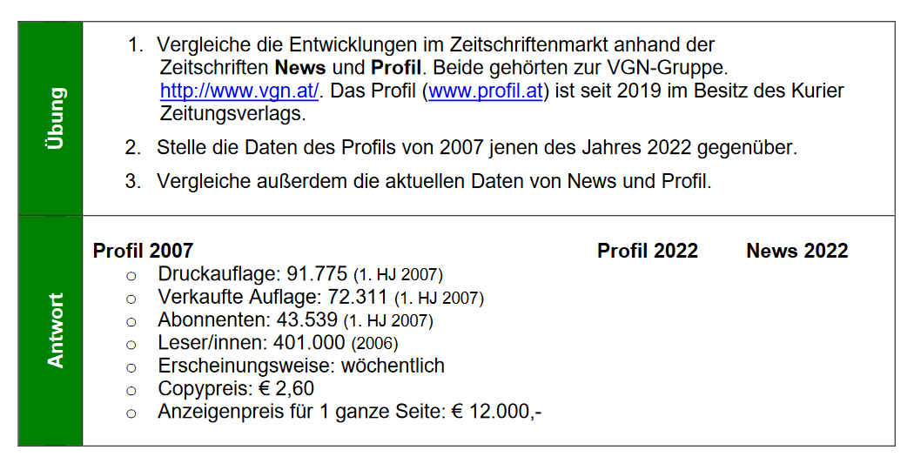
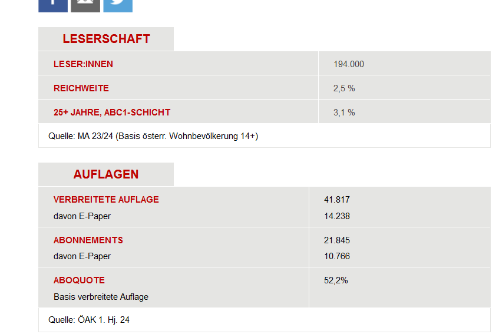
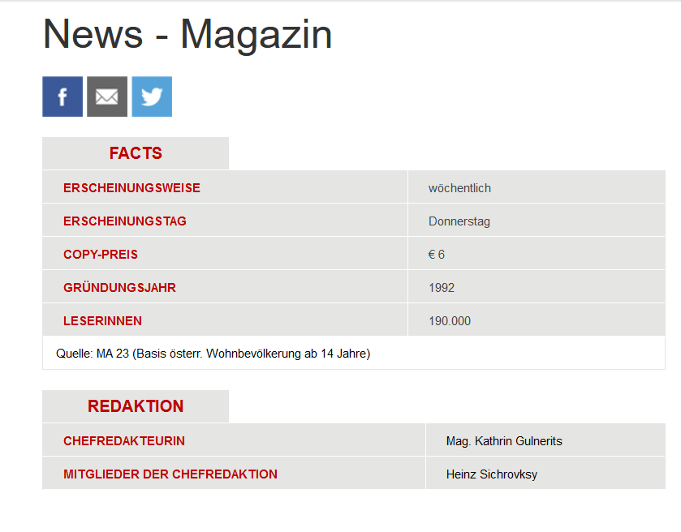
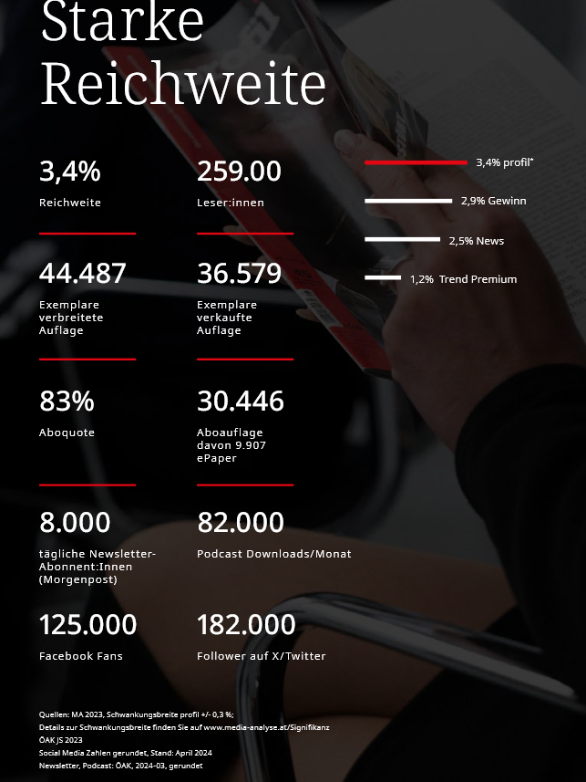

# Zeitschriften

## News

## Profil

## Vergleich

- Druckauflage: 91.775 (1. HJ 2007)

    - Profil: 44 487
    - News: 41 817 | 1. HJ 2024

- Verkaufte Auflage: 72.311 (1. HJ 2007)

    - Profil: 36 579
    - News: ???

- Abonnenten: 43.539 (1. HJ 2007)

    - Profil: 8000
    - News: 

- Leser/innen: 401.000 (2006)
- Erscheinungsweise: wöchentlich
- Copypreis: € 2,60
- Anzeigenpreis für 1 ganze Seite: € 12.000,-