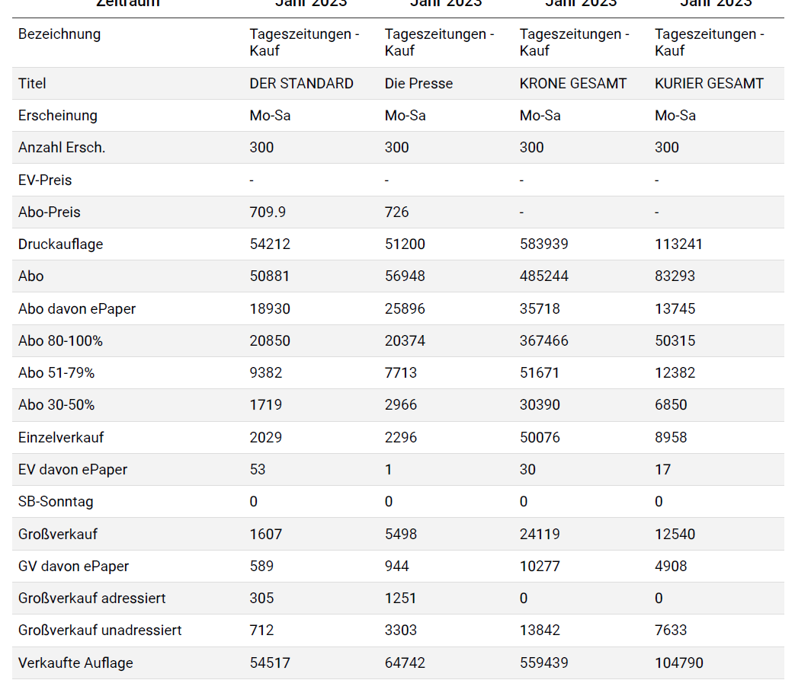
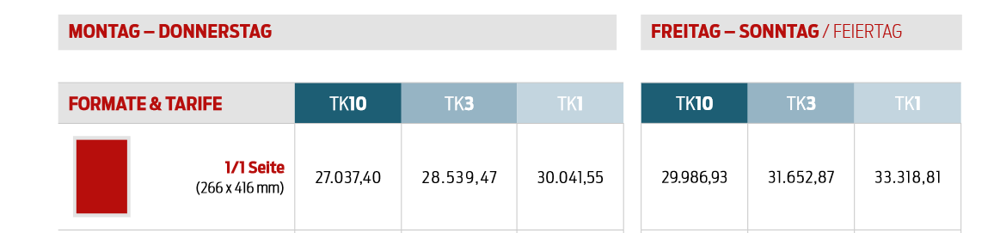
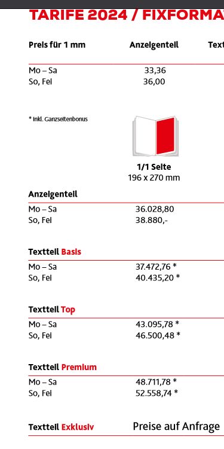

1. 
    - Vergleiche die Druck- bzw. verkauften Auflagen 2006 (siehe oben) mit den Auflagen des Jahres 2022 (Mo-Sa) und ermittle die Rückgänge/Zuwächse. Welcher Trend ist zu erkennen?

    - Lege das Hauptaugenmerk auf die Zeitungen „Die Presse“, „Der Standard“,„Kurier (gesamt)“ und „Kronen Zeitung (gesamt)“!

    - Nutze dazu die Daten der Auflagenkontrolle! http://www.oeak.at/

2. 
    - Ermittle den Anzeigenpreis für eine ganze Seite in Krone bzw. Kurier

### Der Standard

**Druckauflage** von 111 000 auf 54000 gesunken 

### Die Presse

**Druckauflage** von 116 000 auf 51000 gesunken 

### Kurier

**Druckauflage** von 259 000 auf 113 000 gesunken 

### Krone

**Druckauflage** von 1 Millionen auf 580 000 gesunken 

Anzeigenpreis Kurier: 

Anzeigepreis Krone:

## Fazit

es werden weniger print produkte gedruckt und verkauft