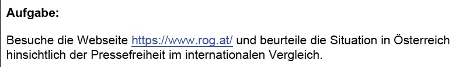
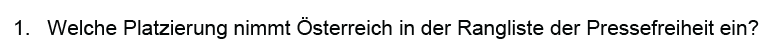
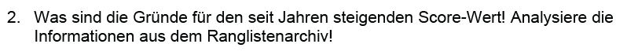
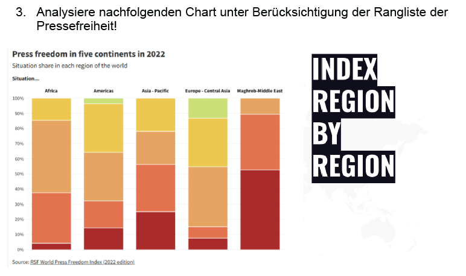
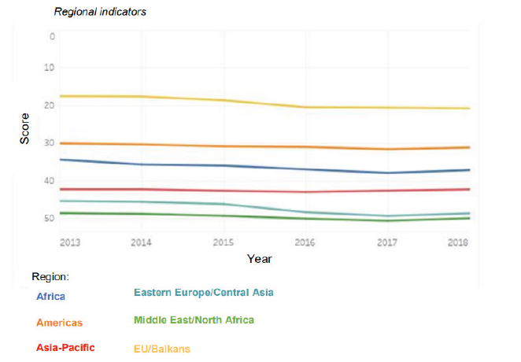

# Aufgabe rog

32. Platz

2020: wegen konservative Parteien
2021: angriffe auf journalisten, versuche die presse zu beeinglussen, ...
2023: kein Informationsfreiheitsgesetz 
2024: fpö oder so

europa am mesiten grün
idk
eastern europe geht nach unten, alles andere bleibt seht gleich
