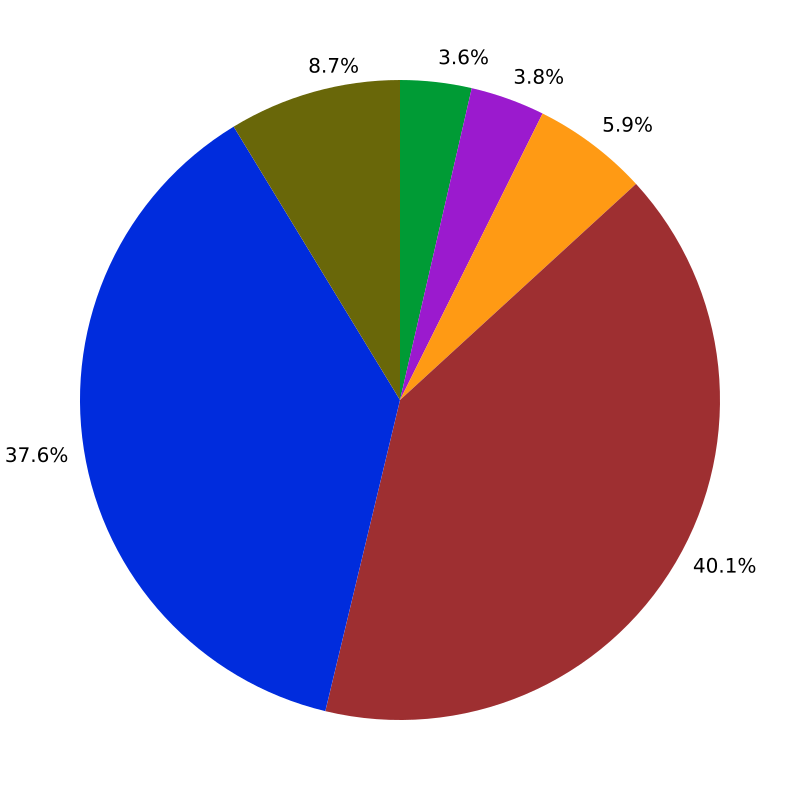
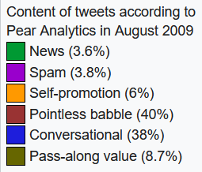
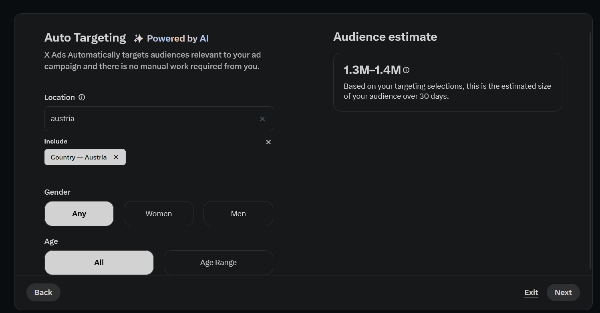
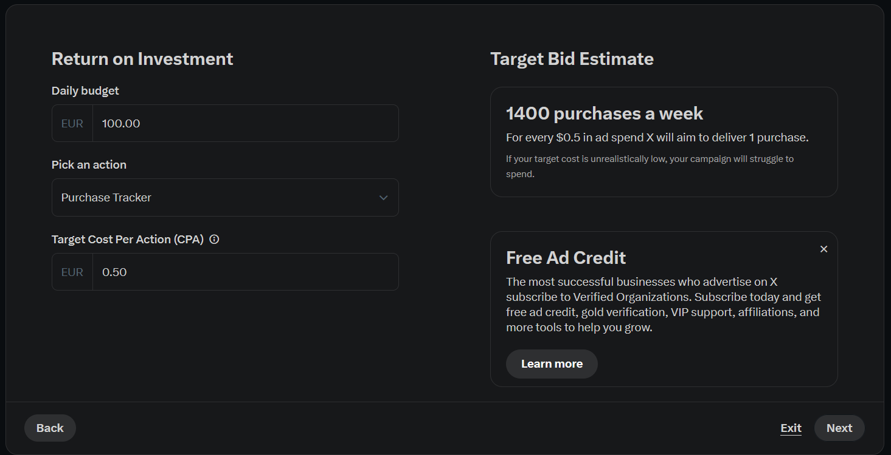
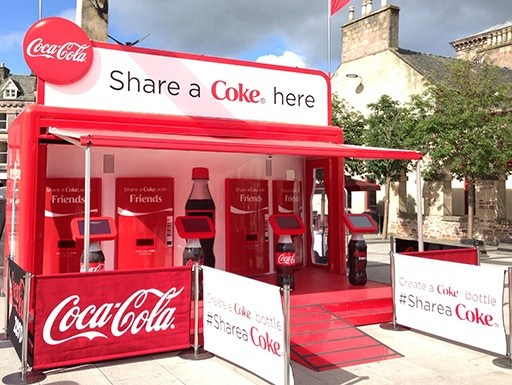

# Marketing auf X (Twitter)
- Buchinger
- Bunea

## Inhalt

1. [Was ist X (Twitter)?](#was-ist-twitter)
2. [X (Twitter) als Marketingplattform](#twitter-als-marketingplattform)
3. [Zielgruppen und Nutzungsverhalten](#zielgruppen-und-nutzungsverhalten)
4. [Werbekosten und Kampagnenstrategien](#werbekosten-und-kampagnenstrategien)
5. [Best Practices und Erfolgsfaktoren](#best-practices-und-erfolgsfaktoren)
6. [Fallbeispiele und Erfolgsgeschichten](#fallbeispiele-und-erfolgsgeschichten)
7. [Zusammenfassung und Ausblick](#zusammenfassung-und-ausblick)
8. [Quellen](#quellen)

## Was ist X (Twitter)?

- Microblogging Website
- kurze Texte und Bilder in "Tweets"
- Neuigkeiten verbreiten sich schnell
- 368 Millionen Nutzer

- 2006 gegründet
- 2022 von Elon Musk gekauft
- Seitdem "X"

## Wer ist auf X (Twitter)?

- Hauptsächlich Jüngere Personen
- Politiker
- Prominente Personen
- Influencer

## Was wird auf X (Twitter) geposted?

- Neuigkeiten
- Kunst
- Meinungen

- viel Hassrede
- Spam von Bots

## X (Twitter) als Marketingplattform

- Promoted Tweets
- Promoted Accounts
- Video Ads
- Shops

## Werbekosten

- Auktionsmodell
- Ad Credit nötig
- Business Accounts bekommen gratis Ad Credit

- Daily Budget
- CPA (je höher der CPA desto höher wird autoamtisch angeboten bei einer auktion) 
- CPA wird automatisch angepasst

## Effektivät von Werbung auf X (Twitter)

- Schlecht
- ~90% der von Clicks kommen von Bots
- Negative Assoziation von der Plattform

## Vergleich

(vergelcich twitter, reddit, instagram)
(werbekosten, werbeeffetivität)

## Beispiel

#ShareACoke 

seit 2013

#PutACanOnIt; Red Bull

seit 2015

Oreo: "Dunk in the Dark"

2013 Superbowl - Blackout

"You can still dunk in the dark"

Duolingo 

## Quellen

Source: https://www.searchlogistics.com/learn/statistics/twitter-user-statistics/

https://www.forecom-solutions.com/en/blog/how-to-advertise-on-x-step-by-step-set-up

https://en.wikipedia.org/wiki/Twitter