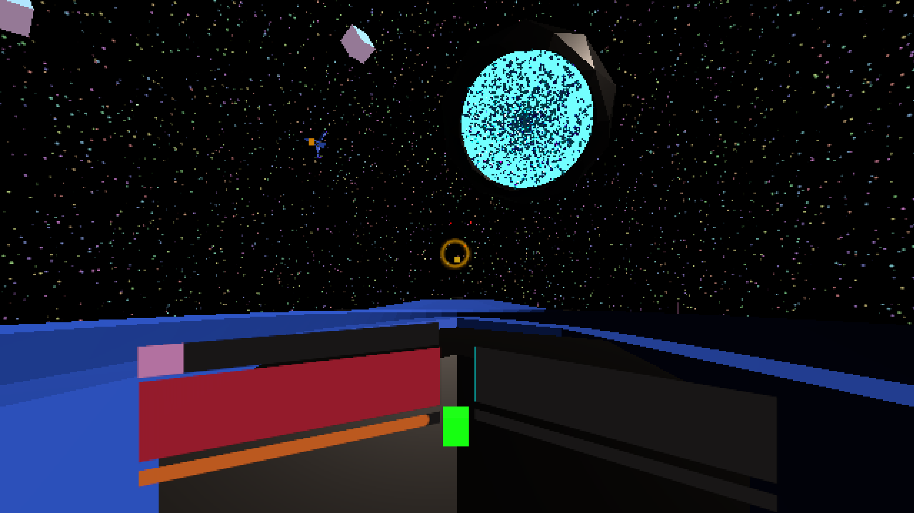
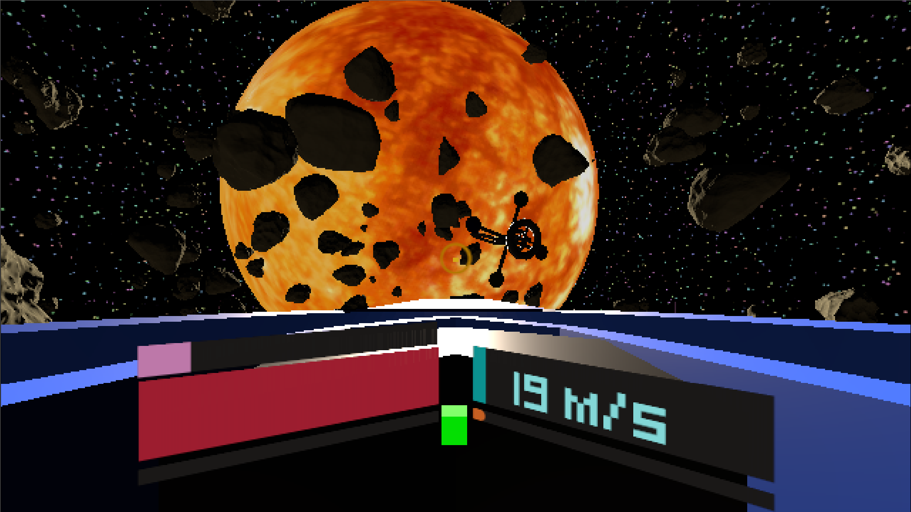

# ODDITY - Infotag Demo

*5AHITM - 2024/25 - Bunea, Bauer, Buchinger*

## Was wird präsentiert?

### Multiplayer Demo

Das ODDITY Multiplayer Demo ist ein einfaches Vier-Spieler-Close-Quarter-Combat-Spiel.

- Jeder Spieler steuert ein Raumschiff mit dem Ziel, die anderen Spieler abzuschießen.
- Raumschiffe haben zwei Metriken: **Leben** und **Hitze**:
  - Wenn ein Spieler abgeschossen wird oder sein Schiff überhitzt, verliert er Leben.
  - Schießen und Boosten erzeugen Hitze.
- Fliegt ein Spieler durch den Ring, erhält er zusätzliches Leben.

*Sonne im Maßstab 1:1, ca. 1 500 000 km entfernt*

## Wie wird präsentiert? 

Für das Multiplayer Demo werden mehrere PCs werden miteinander im Netzwerk verbunden. Es wird zuerst das Oddity Projekt vorgestellt und falls interesse daliegt, wird es dem Besucher möglich sein, das Multiplayer Demo zu spielen. 

