# Schriftmusterblatt

**Bunea**

## Venezianische Renaissance-Antiqua

***Beispiel 1:*** ITC Giovanni

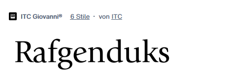

***Open-Type-Funktionen:*** aalt c2sc case frac kern liga lnum onum ordn smcp sups

***Beispiel 2:*** ITC Weidemann

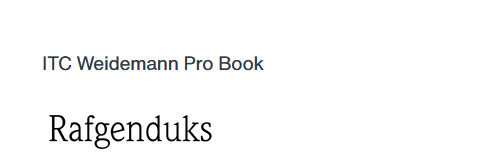

***Open-Type-Funktionen:*** aalt c2sc case cpsp dnom frac kern liga lnum locl numr onum ordn pnum sinf smcp sups tnum

***Beispiel 3:*** Adobe Jenson

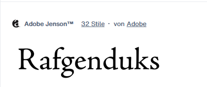

***Open-Type-Funktionen:*** aalt c2sc case cpsp dlig dnom frac hist kern liga lnum locl numr onum ordn ornm pnum sinf size smcp ss01 subs sups tnum zero

## Französische Renaissance-Antiqua

***Beispiel 1:*** Minion

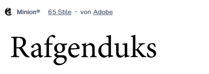

***Open-Type-Funktionen:*** aalt c2sc case cpsp dlig dnom frac hist kern liga lnum locl numr onum ordn ornm pnum salt sinf size smcp ss01 ss02 subs sups tnum zero

***Beispiel 2:*** Granjon

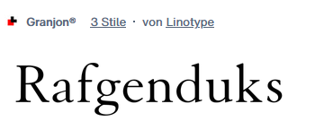

***Open-Type-Funktionen:*** aalt c2sc frac kern liga lnum onum ordn smcp sups

***Beispiel 3:*** Dante

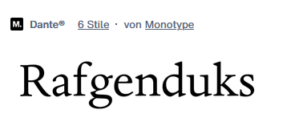

***Open-Type-Funktionen:*** aalt c2sc dnom frac kern liga lnum locl numr onum ordn pnum salt sinf smcp sups titl tnum

## Barock-Antiqua

***Beispiel 1:*** Utopia

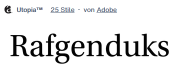

***Open-Type-Funktionen:*** aalt c2sc case cpsp dnom frac kern liga lnum numr onum ordn ornm pnum sinf size smcp subs sups tnum zero

***Beispiel 2:*** ITC Slimbach

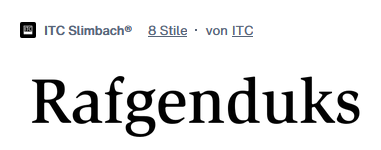

***Open-Type-Funktionen:*** aalt c2sc frac kern liga locl onum ordn smcp sups

***Beispiel 3:*** Perpetua

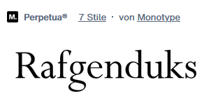

***Open-Type-Funktionen:*** aalt kern ordn sups

## Klassizistische Antiqua

***Beispiel 1:*** Prillwitz

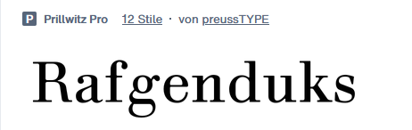

***Open-Type-Funktionen:*** aalt c2sc calt case cpsp dlig dnom frac hist kern liga lnum locl numr onum ordn pnum salt sinf size smcp ss01 sups tnum zero

***Beispiel 2:*** New Caledonia

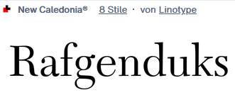

***Open-Type-Funktionen:*** aalt c2sc frac kern liga lnum onum ordn smcp sups

***Beispiel 3:*** Kepler

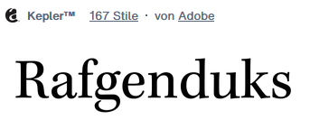

***Open-Type-Funktionen:*** aalt c2sc case cpsp dlig dnom frac kern liga lnum numr onum ordn ornm pnum salt sinf size smcp subs sups tnum zero

## Serifenbetonte Linear-Antiqua

***Beispiel 1:*** Joanna

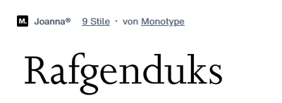

***Open-Type-Funktionen:*** aalt c2sc case dnom frac kern liga lnum locl numr onum ordn pnum smcp sups tnum

***Beispiel 2:*** LinoLetter

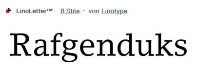

***Open-Type-Funktionen:*** aalt c2sc frac kern liga lnum onum ordn smcp sups

***Beispiel 3:*** Corporate E

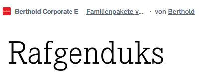

***Open-Type-Funktionen:*** aalt c2sc case cpsp frac kern liga lnum locl onum ordn pnum smcp ss01 sups tnum

## Serifenlose Linear-Antiqua

***Beispiel 1:*** Microgramma

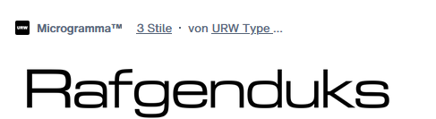

***Open-Type-Funktionen:*** aalt kern liga locl

***Beispiel 2:*** Eurostile

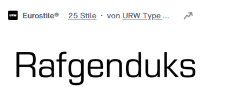

***Open-Type-Funktionen:*** aalt kern liga locl

***Beispiel 3:*** Syntax

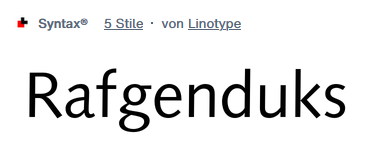

***Open-Type-Funktionen:*** aalt dlig frac kern liga locl ordn sups

## Antiqua-Varianten

***Beispiel 1:*** FF Blur

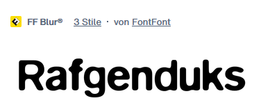

***Open-Type-Funktionen:*** aalt calt case cpsp kern locl ordn ornm tnum

***Beispiel 2:*** FF Berlage Burch

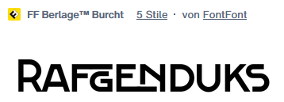

***Open-Type-Funktionen:*** aalt calt case dlig kern locl onum ordn rlig ss01

***Beispiel 3:*** FF Localizer

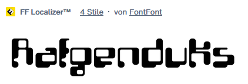

***Open-Type-Funktionen:*** aalt case cpsp kern liga ordn ornm

## Schreibschriften

***Beispiel 1:*** Typo Upright

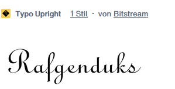

***Open-Type-Funktionen:*** /

***Beispiel 2:*** Mistral

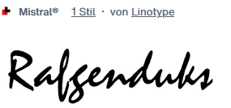

***Open-Type-Funktionen:*** aalt dlig frac kern liga locl ordn sups

***Beispiel 3:*** Schnell Roundhand

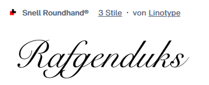

***Open-Type-Funktionen:*** aalt frac init kern liga ordn sups

## Handschriftliche Antiqua

***Beispiel 1:*** Arkona

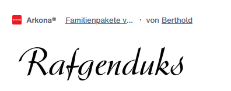

***Open-Type-Funktionen:*** aalt case cpsp frac hist kern liga locl ordn pnum ss01 sups tnum

***Beispiel 2:*** Kaufmann

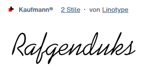

***Open-Type-Funktionen:*** aalt frac kern liga ordn sups

***Beispiel 3:*** Vivaldi

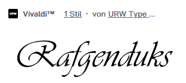

***Open-Type-Funktionen:*** aalt kern liga locl

## Gebrochene Schriften

***Beispiel 1:*** Bastarda

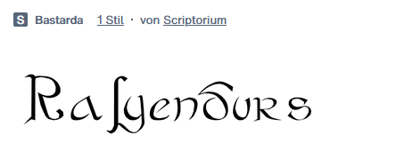

***Open-Type-Funktionen:*** /

***Beispiel 2:*** Breite Kanzlei

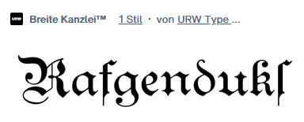

***Open-Type-Funktionen:*** aalt dnom fina frac hist kern liga numr ordn

***Beispiel 3:*** RMU Wallau

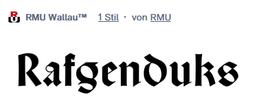

***Open-Type-Funktionen:*** aalt dlig frac hist kern liga ordn salt sups