# Protokoll Lightroom Workshop
Bunea

---

## Bild 1

### Originalbild  
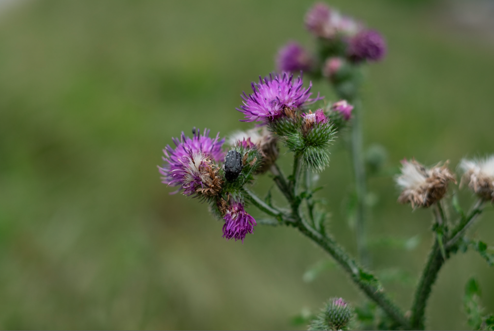

### **Primärkorrektur**  

#### **Profile**  
- Camera Pro Neg Std  

#### **Basic**  
- **Exposure**: +0,44  
- **Contrast**: +26  
- **Shadows**: +23  
- **Blacks**: +30  
- **Texture**: +7  
- **Vibrance**: +33  

#### **Detail**  
- **Amount**: 50  
- **Masking**: 27  

### **Ergebnis nach Primärkorrektur**  
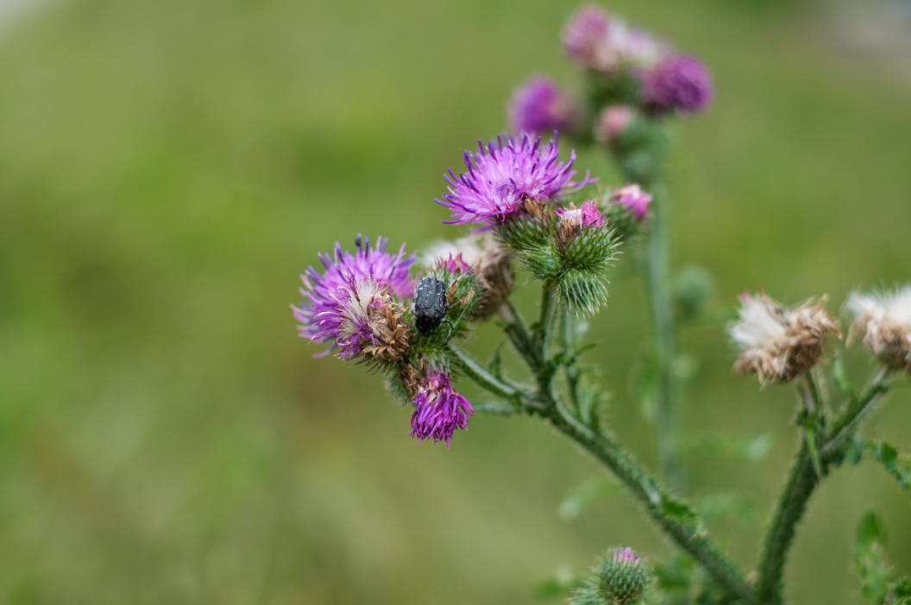

---

## **Sekundärkorrektur**  

#### **Color Grading**  
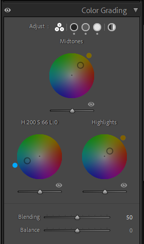  
~ Teal-Orange-Look  

#### **Effekte**  
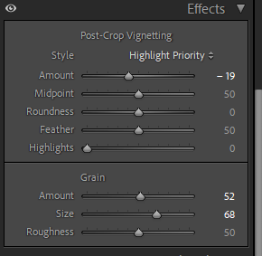  
- Vignette  
- Grain  

#### **Maske**  
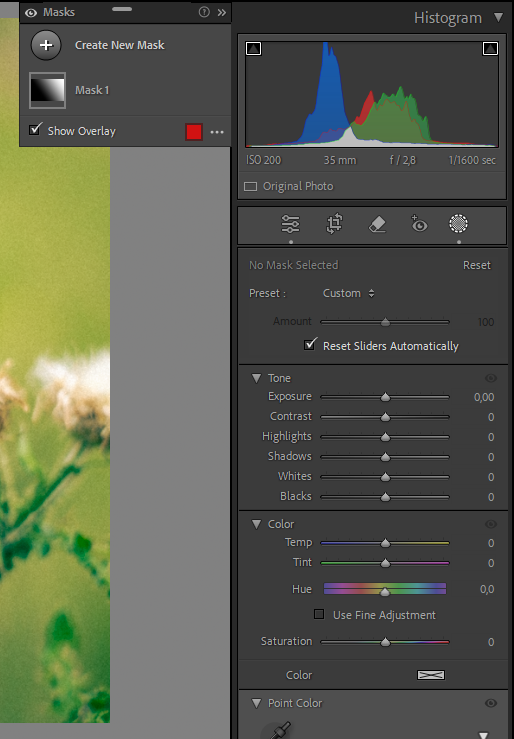  
~ Gradient Mask  
- **Exposure**: +1,09  

### **Endergebnis**  
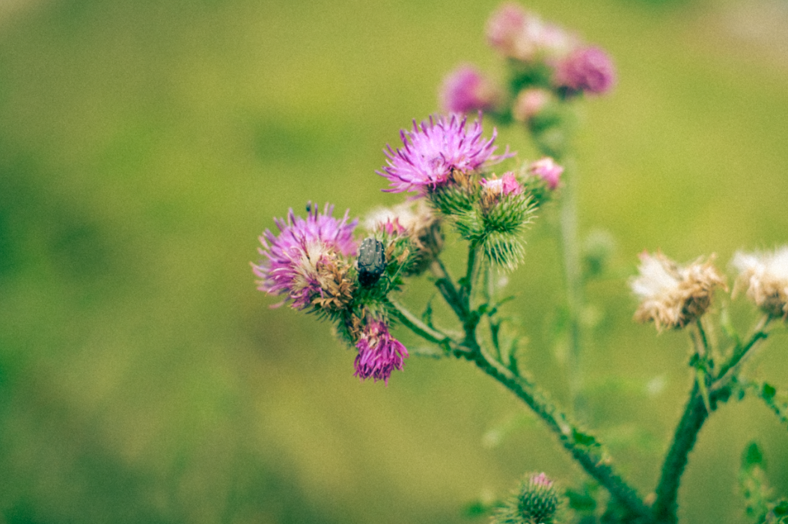

---

## Bild 2  

### Originalbild  
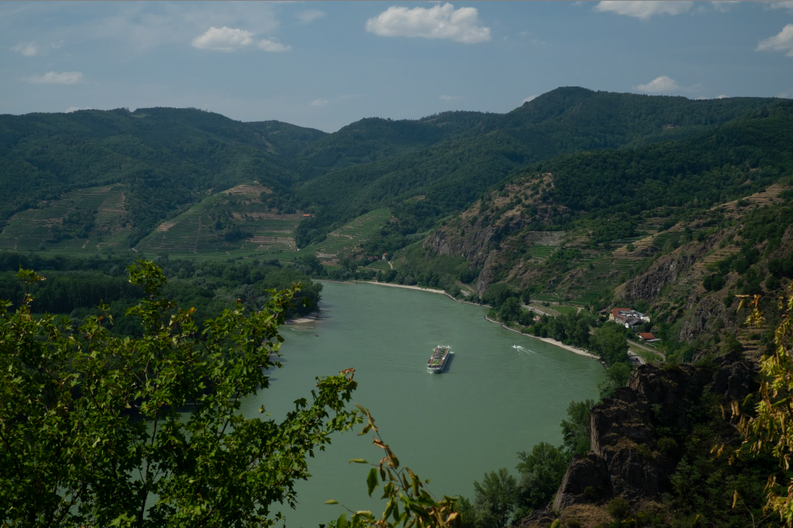

### **Primärkorrektur**  

#### **Basic**  
- **Contrast**: +26  
- **Highlights**: +18  
- **Shadows**: +30  
- **Whites**: +23  
- **Blacks**: +23  
- **Texture**: +12  
- **Clarity**: +12  
- **Dehaze**: +16  
- **Vibrance**: +7  

#### **Detail**  
- **Amount**: +50  

### **Ergebnis nach Primärkorrektur**  
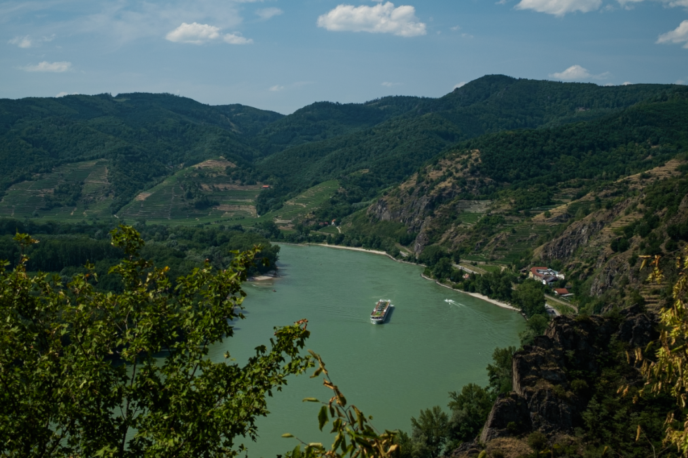

---

## **Sekundärkorrektur**  

#### **Profile**  
- Provia/Standard  

#### **Tone Curve**  
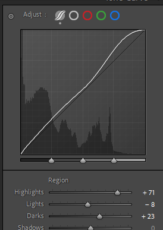  

#### **Color Grading**  
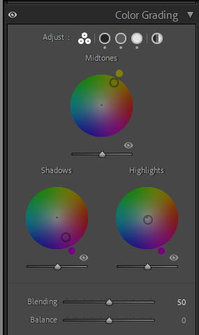  
~ Triad-Komplementär  

#### **Effekte**  
- **Vignette Amount**: -5  

### **Endergebnis**  
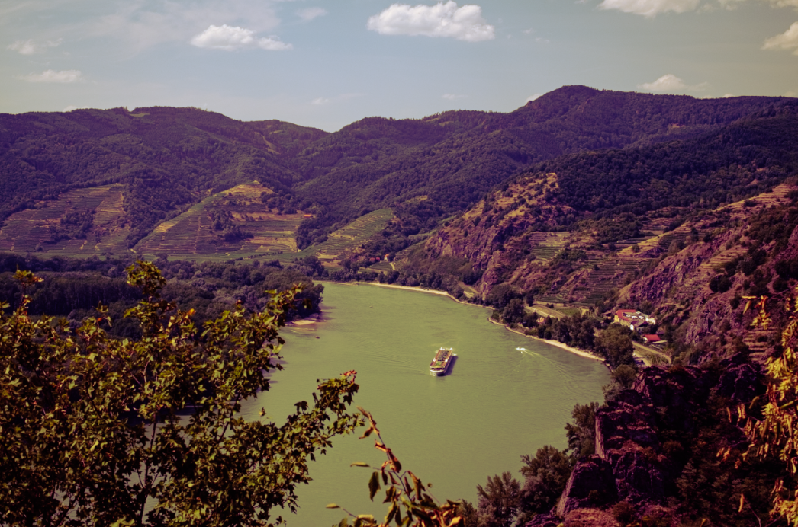

---

## Bild 3  

### Originalbild  
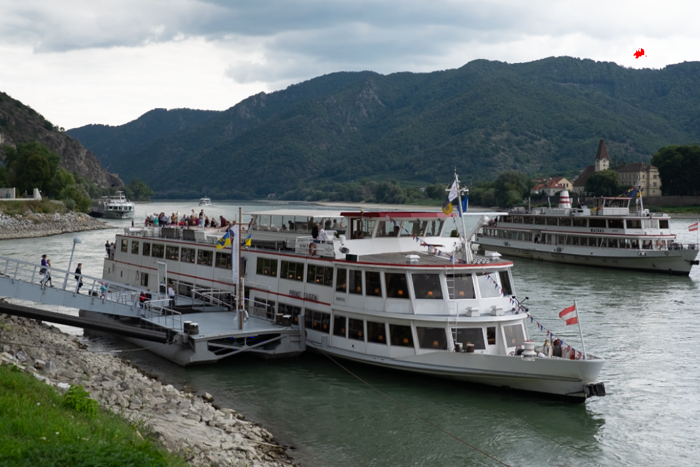

### **Primärkorrektur**  

#### **Profile**  
- Adobe Monochrome  

#### **Basic**  
- **Contrast**: +37  
- **Highlights**: -33  
- **Blacks**: +46  
- **Texture**: +23  
- **Clarity**: +14  

#### **Tone Curve**  
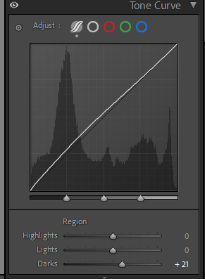  

### **Ergebnis nach Primärkorrektur**  
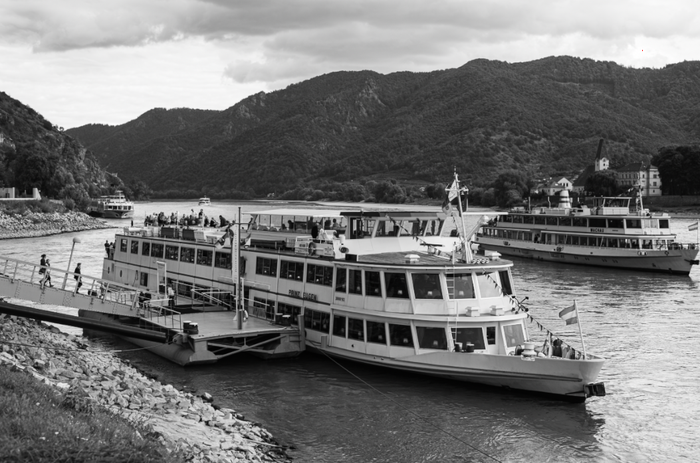

---

## **Sekundärkorrektur**  

#### **Effekte**  
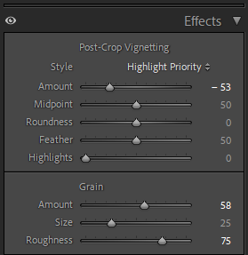  
- Vignette  
- Grain  

#### **Masken**  
- **Schiffe**  
  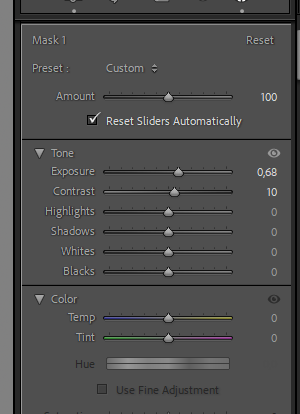  
  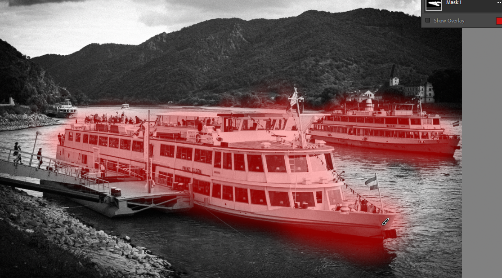  

- **Himmel**  
  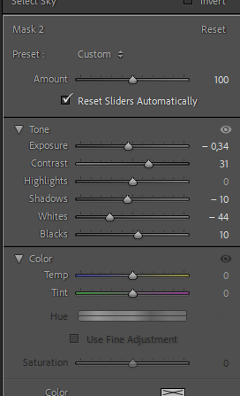  
  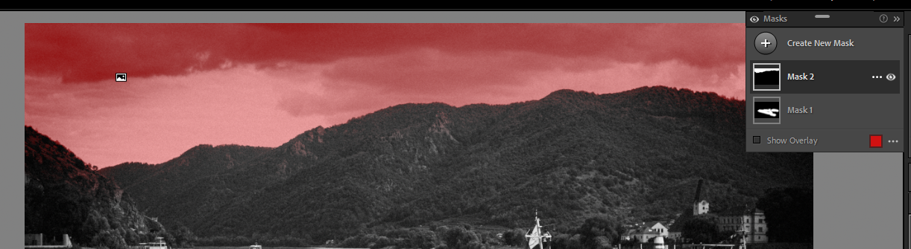  

### **Endergebnis**  
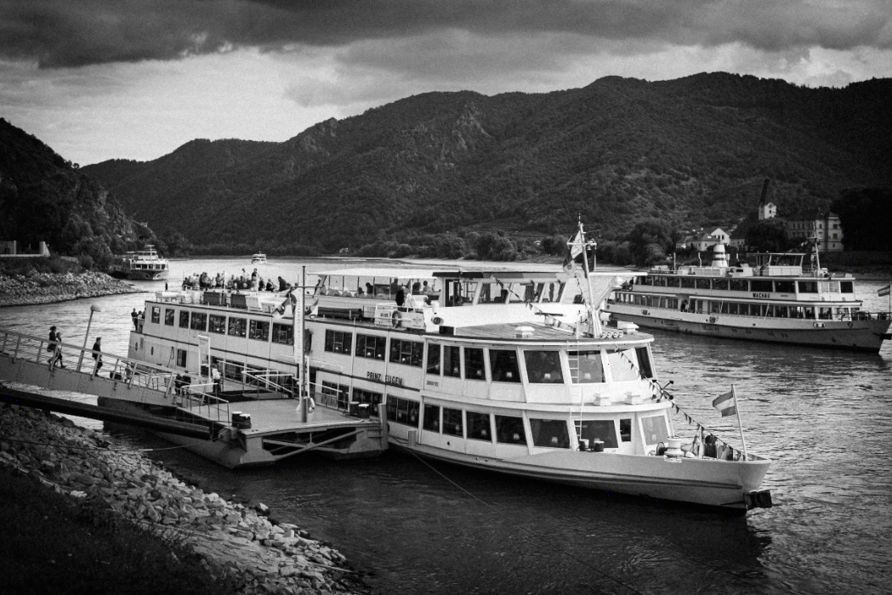

---
