# PLF 2025-02-26

Bunea

## 1. Night Shot

LUT

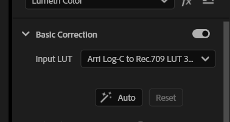

Kreative Lut

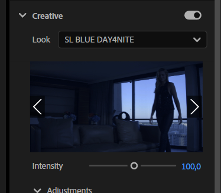

Comparison View

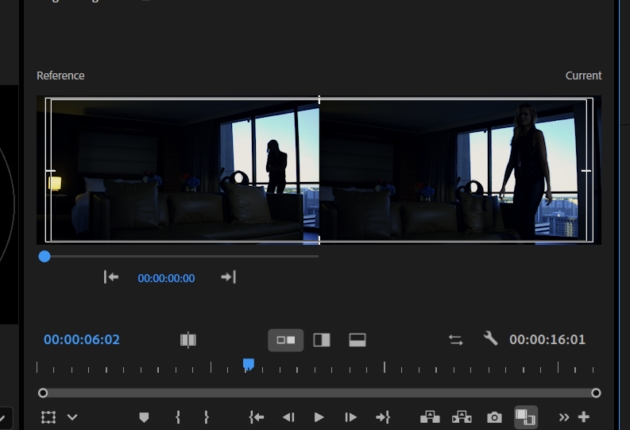

Video Limiter --> 90 IRE

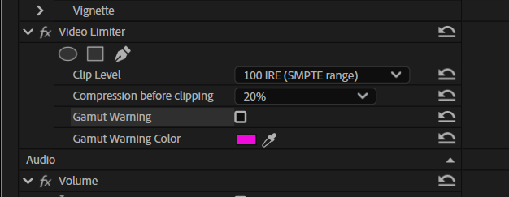

10 IRE Limit

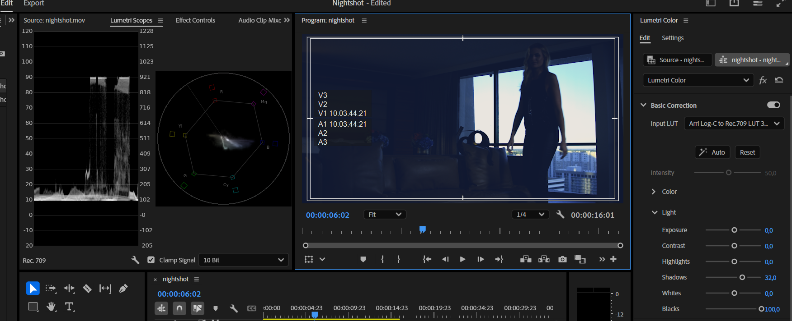

SAFE AREAS EBU 

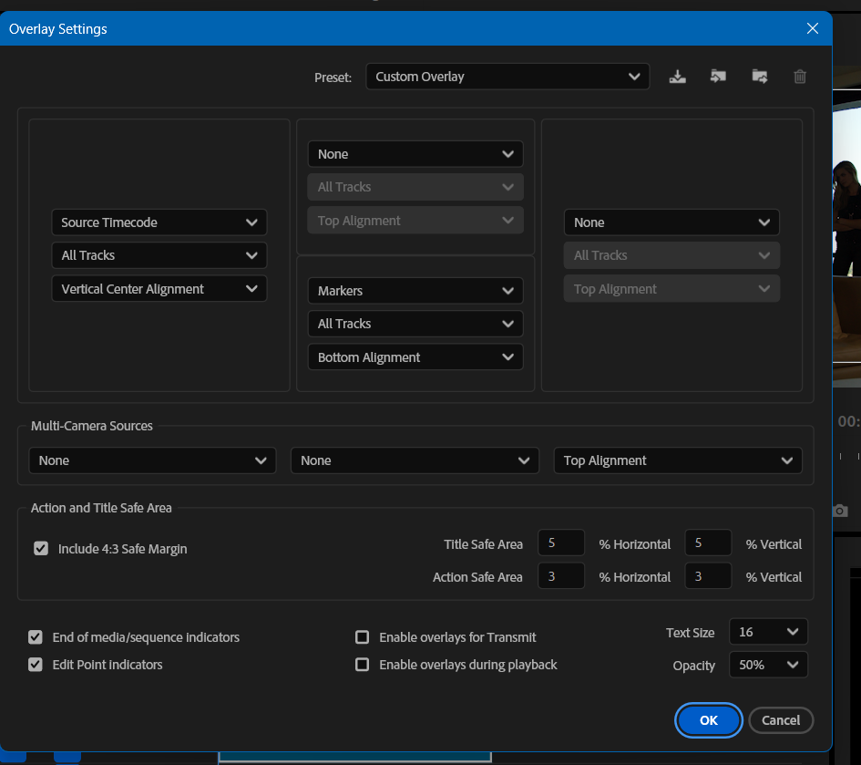

### Zusätziche Screen Shots

comparison view
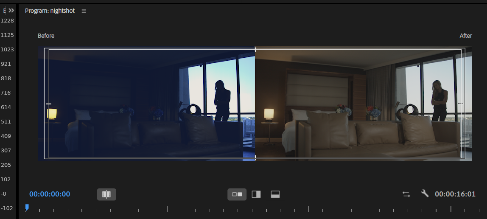

IRE
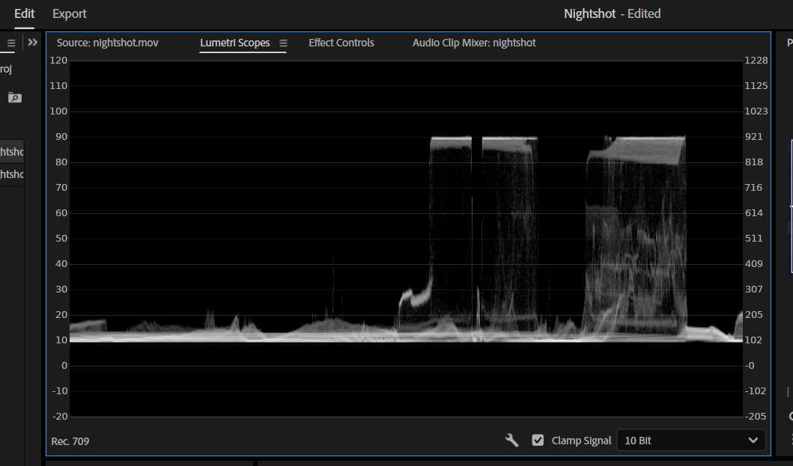

Safe Areas
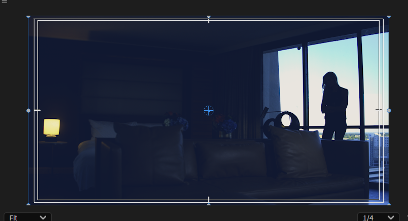

## 2. The Critic

Proxy Medien Erstellen

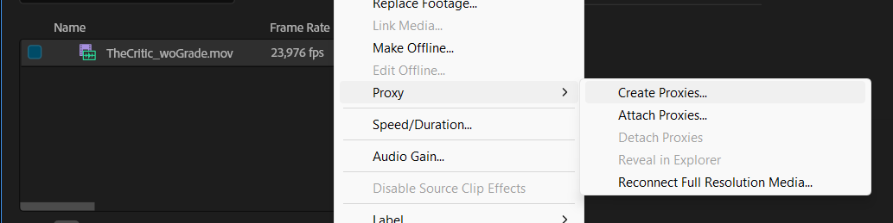

Adjustment Layers

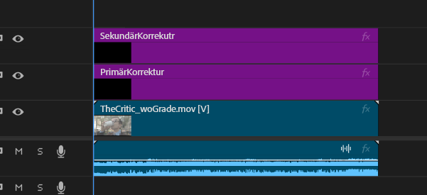

LUT

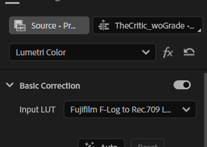

Gesicht - korrekt beleuchtet

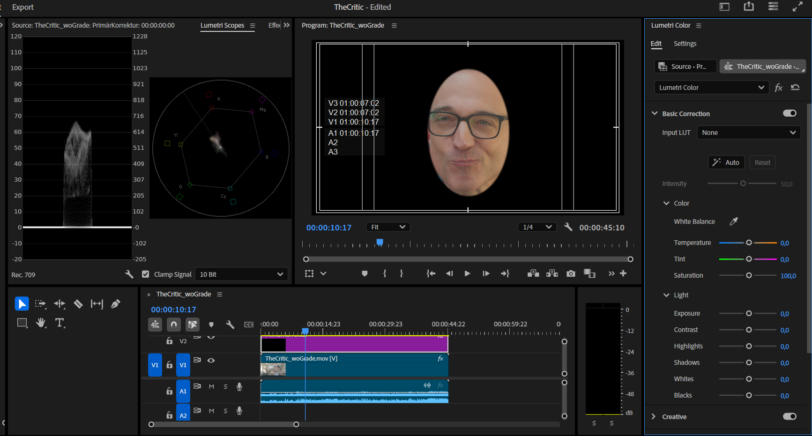

Farbe - Weißer Trinkbehälter als Referenz
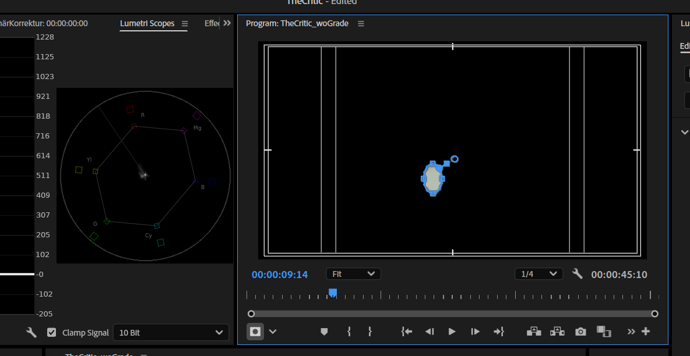

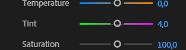

Kontrast erhöht

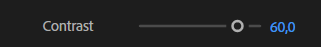

Sekundär korrektur

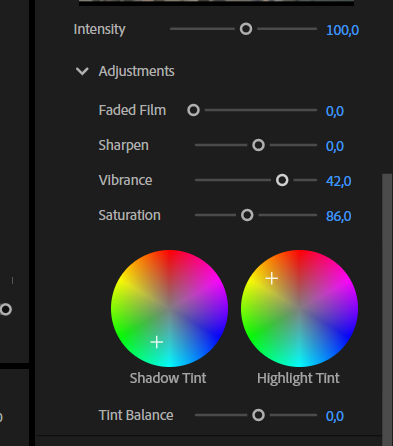

Hemd:

Masken
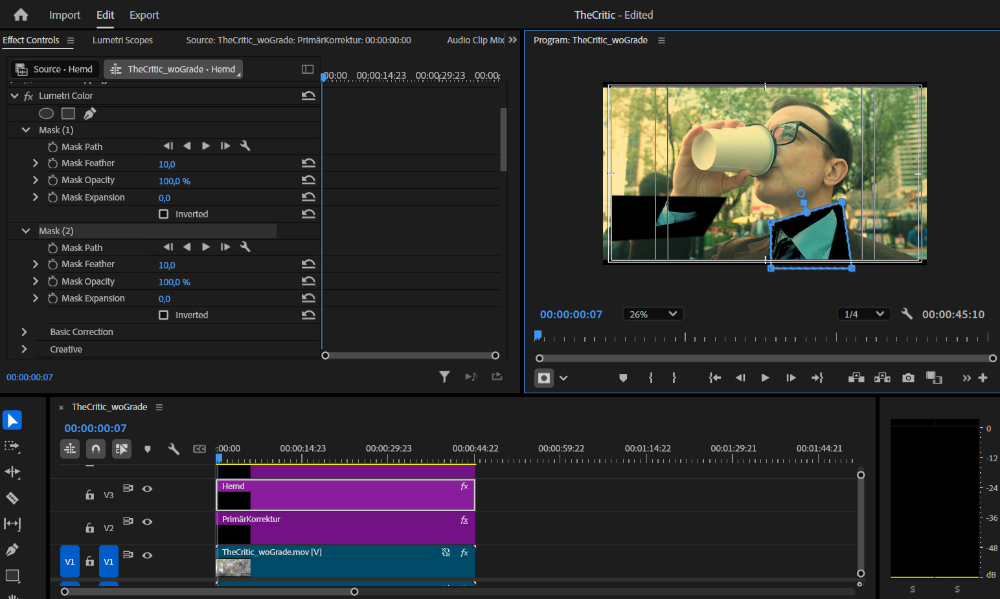

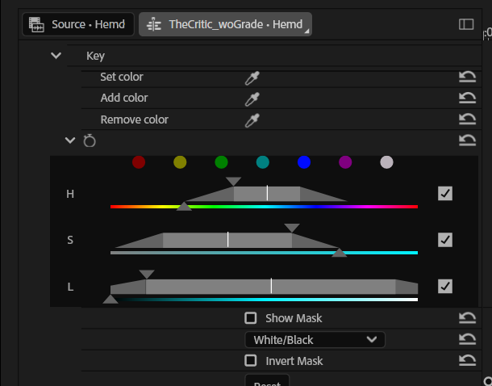

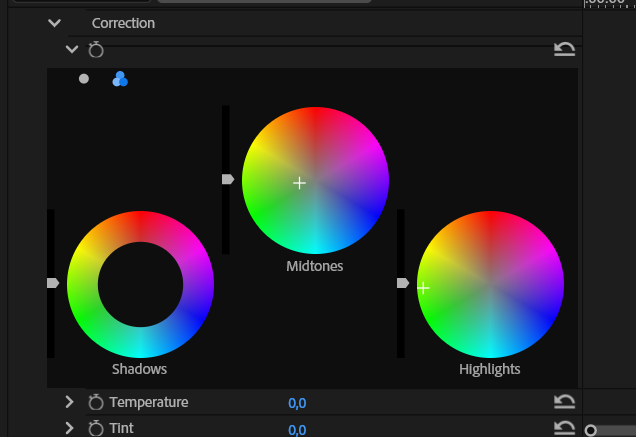

## 3. Szenen.mp4 Teal Orange

## 4. DSF4066.RAF Lightroom

Primär korrektur

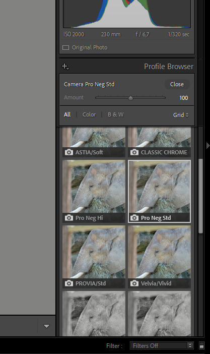

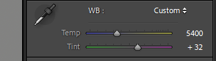 Pipette

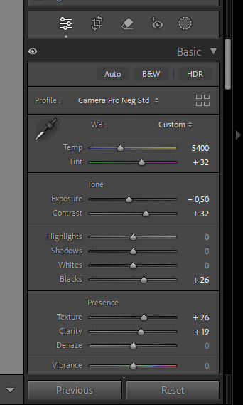

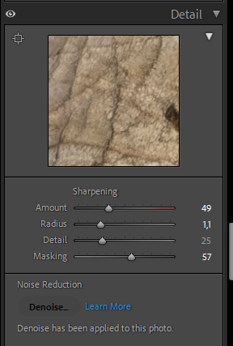

denoise

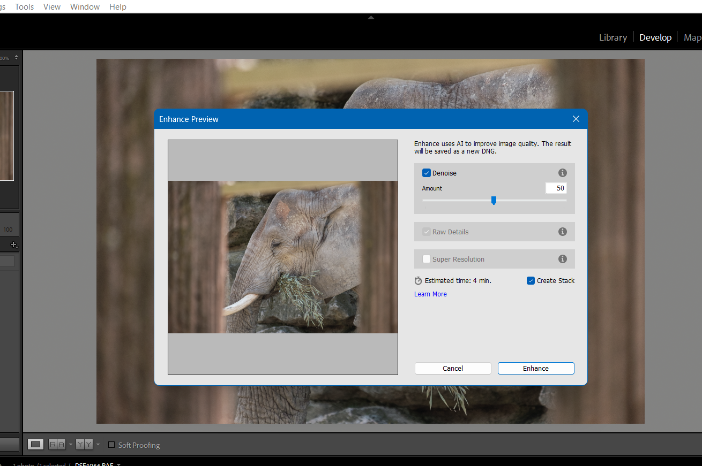

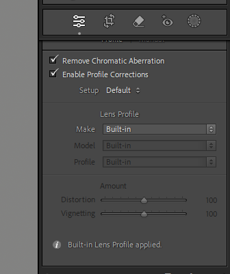

Color Grading 

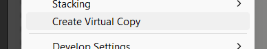

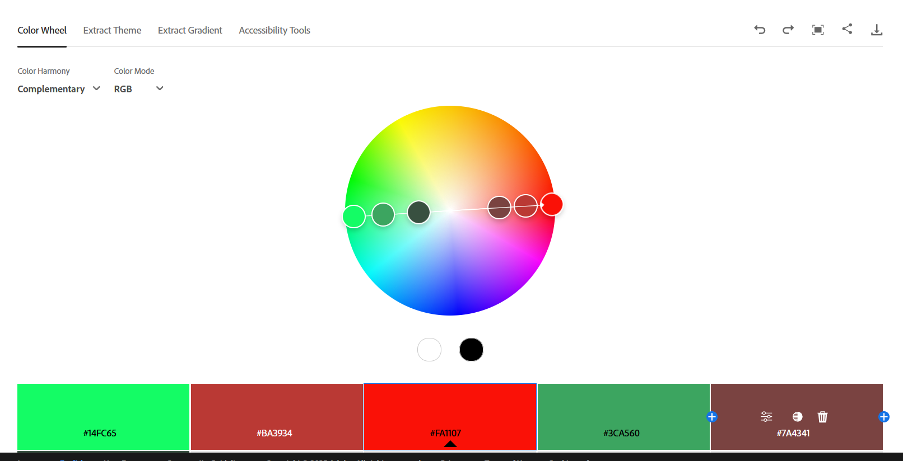

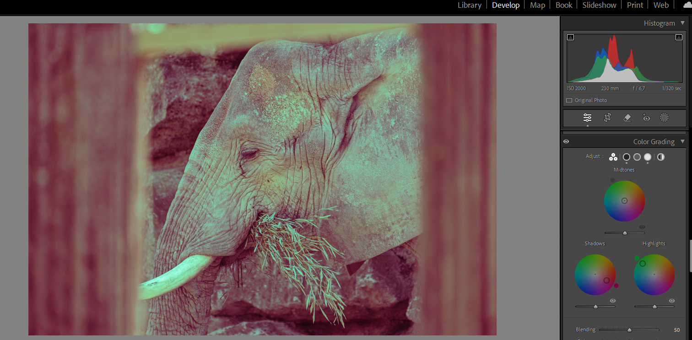

## 5. DSF0947.RAF Lightroom