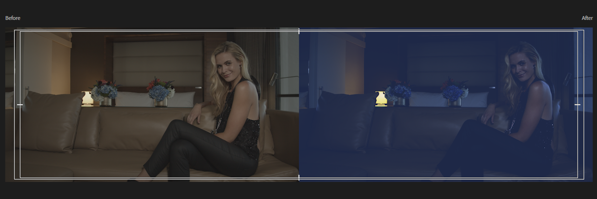

# PLF 2025-02-26

Bunea

## 1. Night Shot

LUT

Kreative Lut

Comparison View

Video Limiter Effekt --> 90 IRE

10 IRE Limit

SAFE AREAS EBU 

## 2. The Critic

Proxy Medien Erstellen

Adjustment Layers

LUT

Gesicht - korrekt beleuchtet

Farbe - Weißer Trinkbehälter als Referenz

Kontrast erhöht

Sekundär korrektur

Hemd:

Masken

Gesicht:

invertierte maske auf sekundär korrektur

mit keyframes gesicht getrackt

## 3. Szenen.mp4 Teal Orange
 
## 4. DSF4066.RAF Lightroom

Primär korrektur

 Weißabgleich mit Pipette

sharpening

denoise mit AI Funktion von LRC

Profile Corrections

Color Grading 

export jpg, sRGB

## 5. DSF0947.RAF Lightroom

Primär Korrektur

SekundärKorrektur

entfernung vom Stein

kontrast erschaffen

sky mask

linear gradient

Brush Mask

vignette 

körnung

